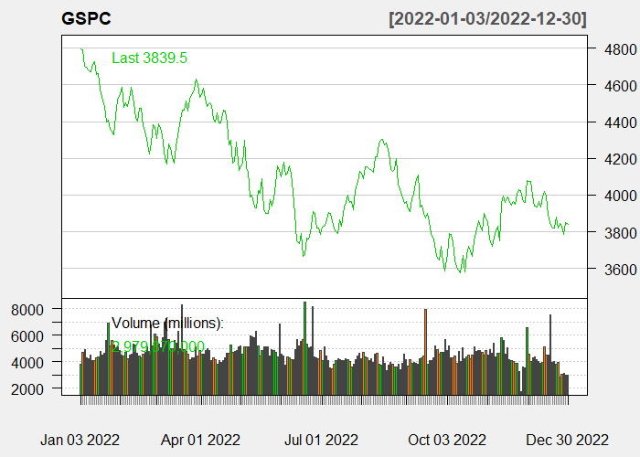
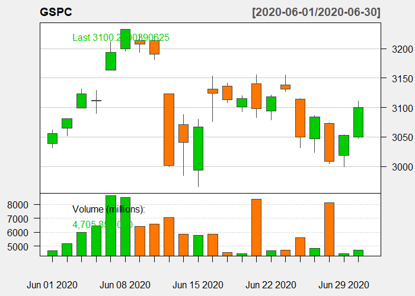
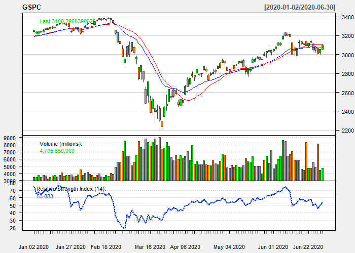
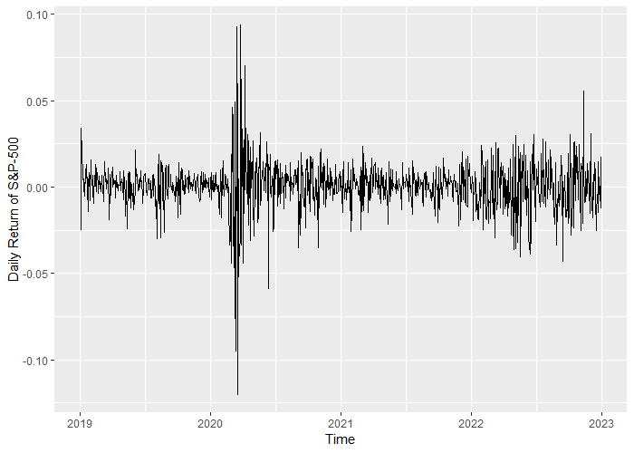
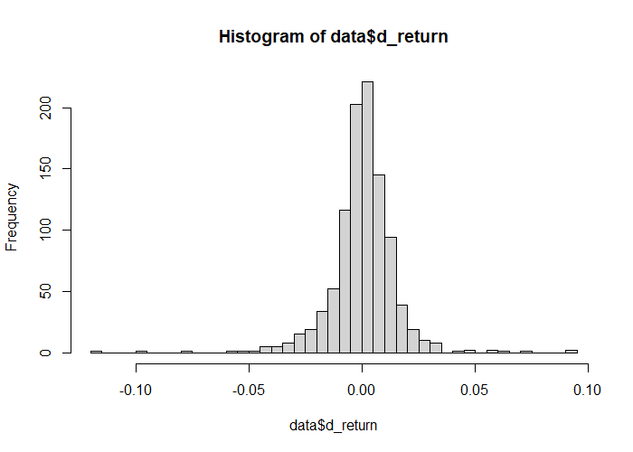
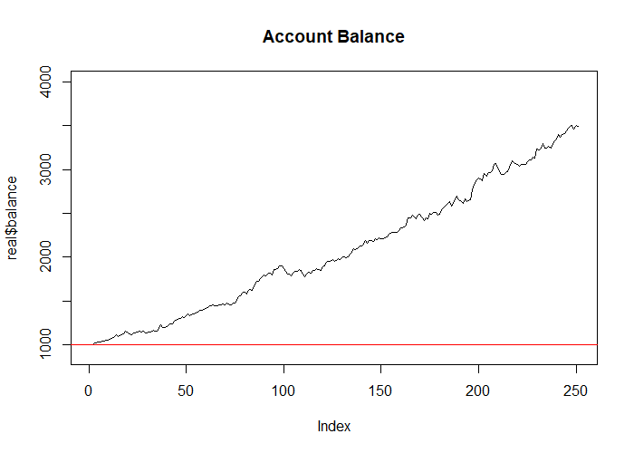

# R_CS_08
Algorithmic Trading in R

### Case-Study Title: Using Classification algorithms in financial markets (Stock Market Prediction)
### Data Analysis methodology: CRISP-DM
### Dataset: S&P-500 (The Standard and Poor's 500) Timeseries data from 2019 to 2022
### Case Goal: Create an automatic financial trading algorithm for S&P-500 index (Algorithmic Trading)

Line chart of daily GSPC Close Price changes in 2022

Candlestick chart of daily GSPC Close Price changes in the June of 2020

Candlestick chart via RSI-14, EMA-20 and SMA-20 technical indices of daily GSPC Close Price changes in the first 6 months of 2020

Daily Return changes of S&P-500 during 3 years (from 2019 to 2022)

The Histogram of Daily Return of S&P-500 during 3 years(from 2019 to 2022)

Line chart of virtual account balance changes from 3 January 2022 till 30 December 2022 managed by our AlgoTrading machine

